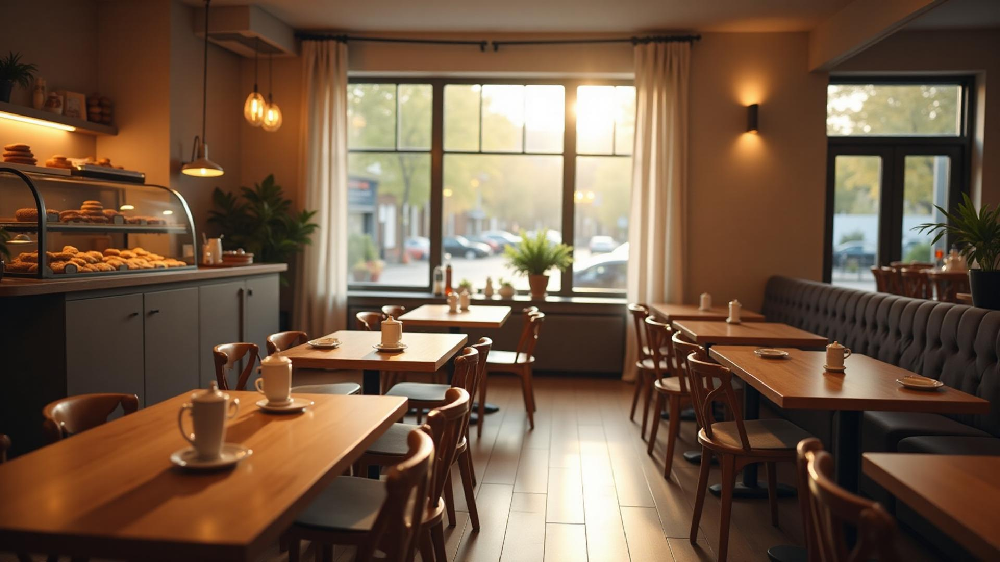
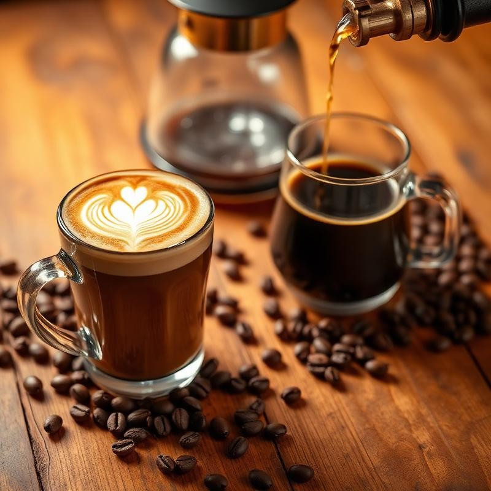

<!DOCTYPE html>
<html lang="id">
<head>
    <meta charset="UTF-8">
    <meta name="viewport" content="width=device-width, initial-scale=1.0">
    <title>Simpfoni Cafe</title>
    <meta name="description" content="Experience exceptional coffee and freshly baked goods in a warm, inviting atmosphere. Visit The Modern Café for artisan brews and delicious treats.">
    <link rel="preconnect" href="https://fonts.googleapis.com">
    <link rel="preconnect" href="https://fonts.gstatic.com" crossorigin>
    <link href="https://fonts.googleapis.com/css2?family=Playfair+Display:wght@400;600;700&family=Inter:wght@300;400;500;600&display=swap" rel="stylesheet">
    <link rel="stylesheet" href="cafe-website.css">
</head>
<body>
    

    <!-- Navigation -->
    <nav>
        

            

                
                Simpfoni Cafe
            

            <ul class="nav-links">
                <li><a href="#menu" onclick="scrollToSection(event, 'menu')">Menu</a></li>
                <li><a href="#about" onclick="scrollToSection(event, 'about')">Tentang Kami</a></li>
                <li><a href="#contact" onclick="scrollToSection(event, 'contact')">Hubungi Kami</a></li>
            </ul>
        

    </nav>

    <!-- Hero Section -->
    <section class="hero">
        

            
        

        

            <h1 style="color: aliceblue;">Nikmati Harimu Dengan Secangkir Kopi</h1>
            
Menyediakan ruang nyaman bagi pelanggan Dengan rasa nyaman seperti rumah
                Ngopi,Kerja,Atau Bersantai terasa hangat di sini.

            

                <a href="#menu" class="btn" onclick="scrollToSection(event, 'menu')">Lihat Menu Kami</a>
                <a href="#contact" class="btn btn-outline" onclick="scrollToSection(event, 'contact')">Pelajari Lebih lanjut </a>
            

        

    </section>

    <!-- About Section -->
    <section id="about" class="about">
        

            <h2>Tentang Kami</h2>
            <video width="640" height="360" controls autoplay loop muted poster="poster.jpg">
                <source src="kopi.mp4" type="video/mp4">
            </video>
            
Didirikan dengan semangat untuk kopi yang luar biasa dan komunitas, Simpfoni Cafe menyatukan bahan-bahan berkualitas, keahlian terampil, dan keramahan yang hangat
                demi kenyamanan pelanggan.

        

        

            

                <svg class="feature-icon" viewBox="0 0 24 24" fill="none" stroke="currentColor" stroke-width="2">
                    <path d="M17 8h1a4 4 0 1 1 0 8h-1"/>
                    <path d="M3 8h14v9a4 4 0 0 1-4 4H7a4 4 0 0 1-4-4Z"/>
                    <line x1="6" x2="6" y1="2" y2="4"/>
                    <line x1="10" x2="10" y1="2" y2="4"/>
                    <line x1="14" x2="14" y1="2" y2="4"/>
                </svg>
                <h3>Sumber Kopi</h3>
                
Berasal dari pabrik kopi pilihan yang terjaga kualitasnya

            

            

                <svg class="feature-icon" viewBox="0 0 24 24" fill="none" stroke="currentColor" stroke-width="2">
                    <path d="M19 14c1.49-1.46 3-3.21 3-5.5A5.5 5.5 0 0 0 16.5 3c-1.76 0-3 .5-4.5 2-1.5-1.5-2.74-2-4.5-2A5.5 5.5 0 0 0 2 8.5c0 2.3 1.5 4.05 3 5.5l7 7Z"/>
                </svg>
                <h3>Dibuat dengan Cinta</h3>
                
Setiap Kue dan Minuman dibuat dengan perhatian dan gairah

            

            

                <svg class="feature-icon" viewBox="0 0 24 24" fill="none" stroke="currentColor" stroke-width="2">
                    <path d="M16 21v-2a4 4 0 0 0-4-4H6a4 4 0 0 0-4 4v2"/>
                    <circle cx="9" cy="7" r="4"/>
                    <path d="M22 21v-2a4 4 0 0 0-3-3.87"/>
                    <path d="M16 3.13a4 4 0 0 1 0 7.75"/>
                </svg>
                <h3>Pusat Komunitas</h3>
                
Ruang yang menyambut untuk koneksi dan percakapan

            

        

    </section>

    <!-- Menu Section -->
    <section id="menu" class="menu">
        

            <h2>Menu Kami</h2>
            
Pilihan yang diakurasi dengan cermat untuk Menyenangkan Anda

        

        

            

                
                

                    <h3>Kopi & Minuman</h3>
                    

                        Kopi Susu Gula Aren
                        Rp 15.000
                    

                    

                        Arabika
                        Rp 15.000
                    

                    

                        Kopi Luwak
                        Rp 15.000
                    

                    

                        Kopi Tubruk
                        Rp 15.000
                    

                    

                        Kopi Latte
                        Rp 15.0000
                    

                    

                        Macchiato
                        Rp 20.000
                    

                    

                        Espresso
                        Rp 10.000
                    

                    

                        Kopi Hitam
                        Rp 7.000
                    

                

            

            

                
                

                    <h3>Makanan</h3>
                    

                        Sandwich
                        Rp 17.000
                    

                    

                        Tempe
                        Rp 15.000
                    

                    

                        Bakwan
                        Rp 15.000
                    

                    

                        Risol 
                        Rp 15.000
                    

                    

                        Pisang Coklat
                        Rp 15.000
                    

                    

                        Kentang goreng
                        Rp 15.000
                    

                    

                        Donat
                        Rp 15.000
                    

                    

                        Roti isi ayam
                        Rp 20.000
                    

                

            

        

    </section>

    <!-- Contact Section -->
    <section id="contact" class="contact">
        

            <h2>Hubungi Kami</h2>
            
Mari Datang ke Simpfoni Cafe , Kami ingin melihat anda di Simpfoni Cafe

        

        

            

                <svg class="contact-icon" viewBox="0 0 24 24" fill="none" stroke="currentColor" stroke-width="2">
                    <path d="M20 10c0 6-8 12-8 12s-8-6-8-12a8 8 0 0 1 16 0Z"/>
                    <circle cx="12" cy="10" r="3"/>
                </svg>
                <h3>Lokasi</h3>
                
Indonesia, Prov. Sumatera Utara, Kab. Toba,Kec. Laguboti

            

            

                <svg class="contact-icon" viewBox="0 0 24 24" fill="none" stroke="currentColor" stroke-width="2">
                    <circle cx="12" cy="12" r="10"/>
                    <polyline points="12 6 12 12 16 14"/>
                </svg>
                <h3>Jam Buka</h3>
                
Senin - Kamis : 08:00 - 22:00
                    Jumat : Tutup
                    Sabtu - Minggu : 24 Jam

            

            

                <svg class="contact-icon" viewBox="0 0 24 24" fill="none" stroke="currentColor" stroke-width="2">
                    <path d="M22 16.92v3a2 2 0 0 1-2.18 2 19.79 19.79 0 0 1-8.63-3.07 19.5 19.5 0 0 1-6-6 19.79 19.79 0 0 1-3.07-8.67A2 2 0 0 1 4.11 2h3a2 2 0 0 1 2 1.72 12.84 12.84 0 0 0 .7 2.81 2 2 0 0 1-.45 2.11L8.09 9.91a16 16 0 0 0 6 6l1.27-1.27a2 2 0 0 1 2.11-.45 12.84 12.84 0 0 0 2.81.7A2 2 0 0 1 22 16.92z"/>
                </svg>
                <h3>Telepon</h3>
                
(+62) 123-456-789

            

            

                <svg class="contact-icon" viewBox="0 0 24 24" fill="none" stroke="currentColor" stroke-width="2">
                    <rect width="20" height="16" x="2" y="4" rx="2"/>
                    <path d="m22 7-8.97 5.7a1.94 1.94 0 0 1-2.06 0L2 7"/>
                </svg>
                <h3>Email</h3>
                
simpfonicafe@gmail.com

            

        

    </section>

    <!-- Footer -->
    <footer>
        

            

                

                    <svg width="24" height="24" viewBox="0 0 24 24" fill="none" stroke="currentColor" stroke-width="2">
                        <path d="M17 8h1a4 4 0 1 1 0 8h-1"/>
                        <path d="M3 8h14v9a4 4 0 0 1-4 4H7a4 4 0 0 1-4-4Z"/>
                        <line x1="6" x2="6" y1="2" y2="4"/>
                        <line x1="10" x2="10" y1="2" y2="4"/>
                        <line x1="14" x2="14" y1="2" y2="4"/>
                    </svg>
                    Simpfoni Cafe
                

                
Menyajikan kopi istimewa dan menciptakan momen tak terlupakan sejak 2025.

            

            

                <h3>Link pintas</h3>
                <ul class="footer-links">
                    <li><a href="#about" onclick="scrollToSection(event, 'about')">About</a></li>
                    <li><a href="#menu" onclick="scrollToSection(event, 'menu')">Menu</a></li>
                    <li><a href="#contact" onclick="scrollToSection(event, 'contact')">Contact</a></li>
                </ul>
            

            

                <h3>Ikuti Kami</h3>
                

                    <a href="#" aria-label="Instagram">
                        <svg class="social-icon" viewBox="0 0 24 24" fill="none" stroke="currentColor" stroke-width="2">
                            <rect width="20" height="20" x="2" y="2" rx="5" ry="5"/>
                            <path d="M16 11.37A4 4 0 1 1 12.63 8 4 4 0 0 1 16 11.37z"/>
                            <line x1="17.5" x2="17.51" y1="6.5" y2="6.5"/>
                        </svg>
                    </a>
                    <a href="#" aria-label="Facebook">
                        <svg class="social-icon" viewBox="0 0 24 24" fill="none" stroke="currentColor" stroke-width="2">
                            <path d="M18 2h-3a5 5 0 0 0-5 5v3H7v4h3v8h4v-8h3l1-4h-4V7a1 1 0 0 1 1-1h3z"/>
                        </svg>
                    </a>
                    <a href="#" aria-label="Twitter">
                        <svg class="social-icon" viewBox="0 0 24 24" fill="none" stroke="currentColor" stroke-width="2">
                            <path d="M22 4s-.7 2.1-2 3.4c1.6 10-9.4 17.3-18 11.6 2.2.1 4.4-.6 6-2C3 15.5.5 9.6 3 5c2.2 2.6 5.6 4.1 9 4-.9-4.2 4-6.6 7-3.8 1.1 0 3-1.2 3-1.2z"/>
                        </svg>
                    </a>
                

            

        

        

            
&copy; 2025 Simpfoni Cafe. Hak cipta dilindungi.

        

    </footer>

    
</body>
</html>
